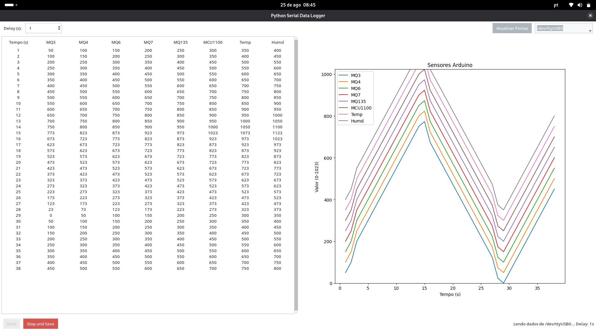

# Python Serial Data Logger com Interface Gráfica

Este é um projeto em Python com uma interface gráfica (GUI) que lê dados de uma porta serial e os exibe em tempo real em uma tabela e em um gráfico. A aplicação também salva os dados coletados em um arquivo xlsx.

O código foi configurado para receber valores por leitura.

---

### Funcionalidades

* **Interface Gráfica (GUI):** Permite selecionar a porta serial e iniciar/parar a leitura dos dados de forma simples.
* **Detecção de Portas:** O software lista automaticamente as portas seriais disponíveis no seu sistema.
* **Monitoramento em Tempo Real:** Exibe os dados recebidos em uma tabela e em um gráfico dinâmico.
* **Delay Configurável:** Permite ajustar o tempo (em segundos) entre cada registro de dados (para funcionar adequadamente o micro controlador deve enviar dados a cada 1 segundo).
* **Salvar Dados:** Os dados coletados podem ser salvos em um arquivo Excel (.xlsx) após a leitura.

---
### Interface




---

### Requisitos

Para rodar a aplicação, você precisa das seguintes bibliotecas Python:

* **pyserial:** Para comunicação com a porta serial.
* **ttkbootstrap:** Para o estilo moderno da interface gráfica (uma extensão do Tkinter).
* **matplotlib:** Para plotagem de gráficos.
* **pandas:** Para manipulação e salvamento dos dados em formato Excel.
* **openpyxl:** Para permitir que o pandas salve arquivos .xlsx.

Você pode instalá-las com o seguinte comando:

```bash
pip install pyserial ttkbootstrap matplotlib pandas openpyxl
```
### Formato de Dados

O programa espera receber uma string com **8 valores numéricos inteiros**, separados por vírgula, terminada por uma quebra de linha (`\n`).

**Exemplo:**
`valor1,valor2,valor3,valor4,valor5,valor6,valor7,valor8`

---

### Como Adaptar para Sua Necessidade

Para usar o código com uma quantidade diferente de dados ou com nomes específicos para cada valor, você precisará editar o arquivo `main.py`.

1.  **Ajuste o Número de Valores:** Na função `read_serial()`, modifique a linha `if len(valores) == 8:` para o número de valores que você está enviando.
2.  **Ajuste os Nomes e Colunas:** Na função `stop_and_save()` e em outras partes do código, edite a lista `colunas` e a lista `nomes` para corresponder aos seus dados.

---

### Como Usar

1.  Clone o repositório.
2.  Instale as bibliotecas necessárias.
3.  Conecte seu dispositivo (Arduino, ESP32, etc.) ao computador.
4.  Execute o script:
    ```bash
    python main.py
    ```
5.  Selecione a porta serial correta na lista e clique em **"Iniciar"**.
6.  Para interromper a leitura e salvar os dados, clique em **"Parar e Salvar"**.
